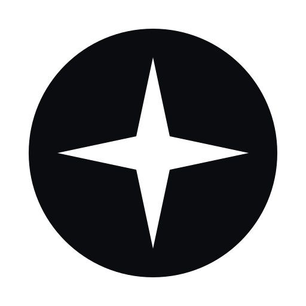
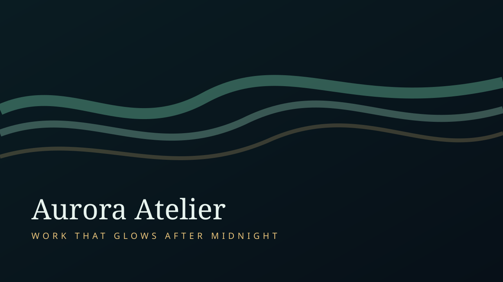
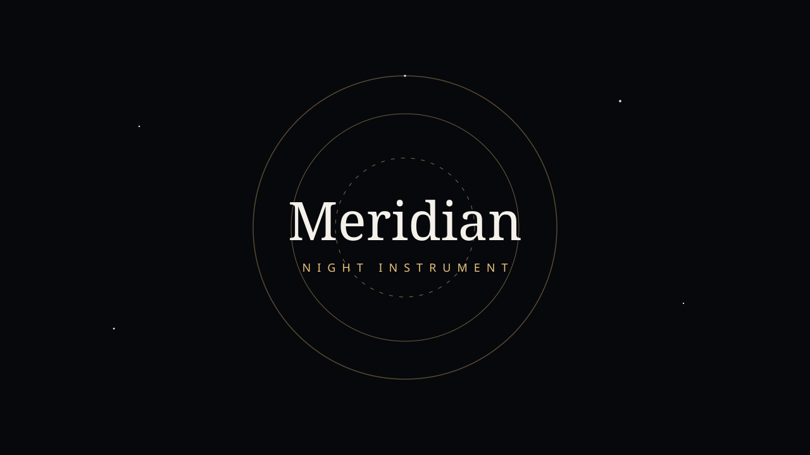
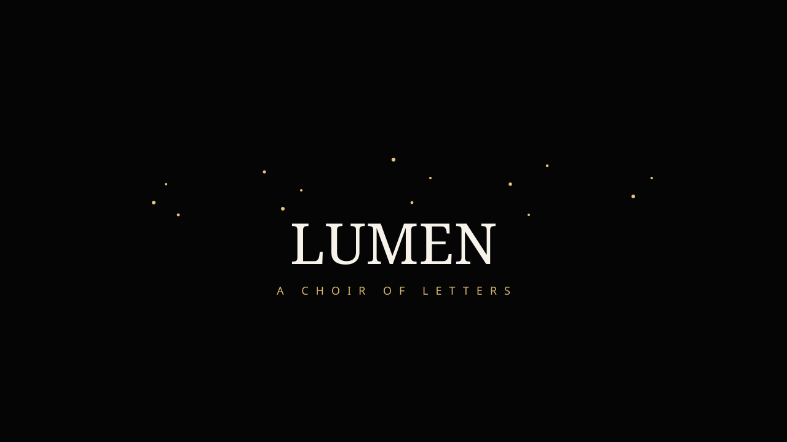
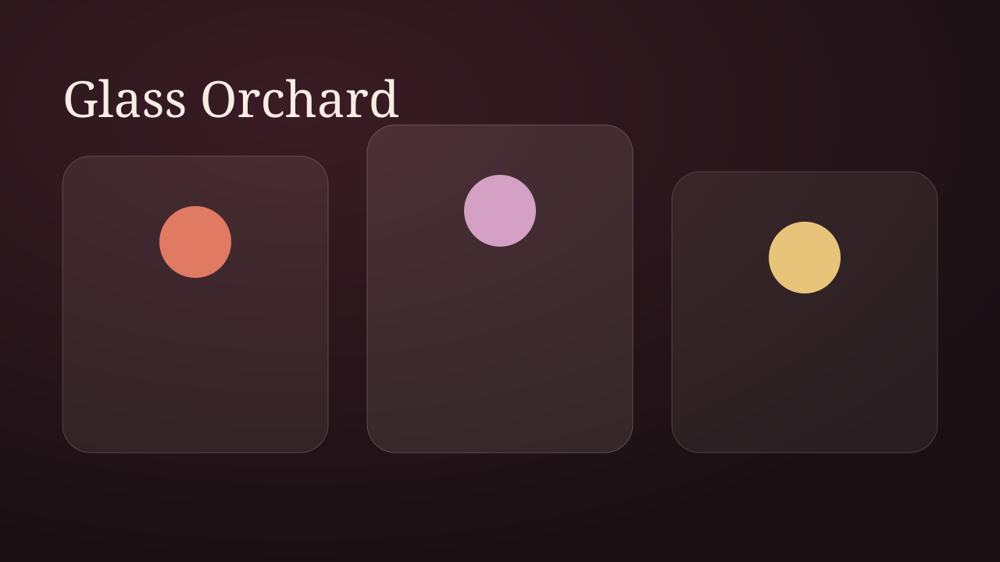

<p align="center">
  
</p>

<h1 align="center">StarX UI</h1>

<p align="center">
  <strong>Live Three.js components. Copy the source. Ship the scene.</strong>
</p>

<p align="center">
  An open catalog of interactive heroes, WebGL backgrounds, motion type, and React renderers — with original StarX pages on top of the ThreeUI Community library.
</p>

<p align="center">
  <a href="https://github.com/alexbieber/starxmicro.ui/stargazers"></a>
  <a href="LICENSE"></a>
  
  
  
</p>

<p align="center">
  <a href="#run-the-catalog">Run locally</a> ·
  <a href="#original-starx-pages">Original pages</a> ·
  <a href="#use-a-component">Use a component</a> ·
  <a href="#whats-inside">Catalog</a>
</p>

<p align="center">
  
</p>

---

## Why this exists

Most shader kits are screenshots. StarX UI is a **running catalog**:

- Click a card, get a live renderer
- Tweak variants and controls in the page
- Copy the React import, the prompt, or the full source
- No login, no Pro wall, no analytics

Forked from [ThreeUI Community](https://github.com/MengTo/threeui) by Meng To / DesignCode, then rebranded and extended with original StarX work.

## Original StarX pages

New pages sit at the top of Browse. They are originals — not restyled ThreeUI templates.

<table>
  <tr>
    <td width="50%">
      <a href="public/starx-pages/aurora-atelier.html"></a>
      <p><strong>Aurora Atelier</strong><br />Midnight landing. Live aurora ribbons, ceremonial type, glass chapters.</p>
    </td>
    <td width="50%">
      <a href="public/starx-pages/meridian-observatory.html"></a>
      <p><strong>Meridian Observatory</strong><br />Night-instrument hero. Gold meridians, star field, live sky HUD.</p>
    </td>
  </tr>
  <tr>
    <td width="50%">
      <a href="public/starx-pages/lumen-choir.html"></a>
      <p><strong>Lumen Choir</strong><br />Typography as light. Pointer scatter, gold particles, the word LUMEN.</p>
    </td>
    <td width="50%">
      <a href="public/starx-pages/glass-orchard.html"></a>
      <p><strong>Glass Orchard</strong><br />Dusk glass cards that tilt like fruit on a branch.</p>
    </td>
  </tr>
</table>

## Run the catalog

Node **20.19+**. Then:

```bash
git clone https://github.com/alexbieber/starxmicro.ui.git
cd starxmicro.ui
npm install
npm run dev
```

Open [http://localhost:5173/browse](http://localhost:5173/browse).

```bash
npm run build      # tests + site + library
npm run preview    # production preview
```

## Use a component

```bash
npm install starx-ui
```

```tsx
import { AuroraAtelier } from "starx-ui";
import "starx-ui/style.css";

export function Hero() {
  return <AuroraAtelier />;
}
```

Smaller import graph:

```tsx
import { AuroraAtelier } from "starx-ui/components/AuroraAtelier";
```

Peers: `react` and `react-dom` 18 or 19, `three` ≥ 0.149.

Some full-document scenes expect runtime files at the same public URLs as the catalog. Copy what you need from `public/` (or `lib-dist/assets/` after `npm run build:lib`) into your app’s public folder.

## What's inside

| Surface | What you get |
| --- | --- |
| Live catalog | Browse, search, variants, controls, code tabs |
| Community library | Landing pages, heroes, backgrounds, buttons, type, UI |
| StarX originals | Aurora Atelier, Meridian Observatory, Lumen Choir, Glass Orchard |
| Source | Implementation files on every component page |
| Shell | Dark/light + palettes (Star, Mono, Sepia, Azure, Moss, Mauve) |

**47** parent components. **No** account, checkout, or Pro catalog.

## Stack

| Layer | Choice |
| --- | --- |
| App | React 19, TypeScript, Vite 8 (Rolldown) |
| Graphics | Three.js, raw WebGL, Canvas 2D, CSS |
| Package | ESM `starx-ui` with per-component subpaths |

## Commands

| Script | Purpose |
| --- | --- |
| `npm run dev` | Catalog on `:5173` |
| `npm test` | Boundary + package tests |
| `npm run build:site` | Typecheck, audit, production site |
| `npm run build:lib` | Publishable component library |
| `npm run build` | All of the above |

## Credits

StarX UI is a fork of [ThreeUI Community](https://github.com/MengTo/threeui). Original application and Community component code remain MIT, copyright Meng To. This fork is not affiliated with DesignCode or [threeui.com](https://threeui.com).

Bundled fonts stay under SIL OFL 1.1. Three.js runtimes stay MIT. See `LICENSE`, `ASSET-LICENSES.md`, `FONT-LICENSES.md`, and `THIRD_PARTY_NOTICES.md`.

## License

MIT. Use it, ship it, make it stranger.
